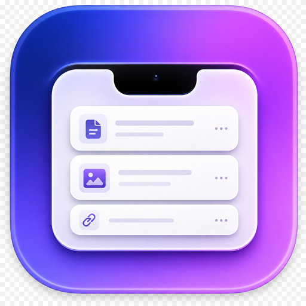

<p align="center">
  
</p>

<h1 align="center">NotchBoard</h1>

A native macOS menu-bar/notch utility. Move the mouse to the notch and a panel
expands with two tabs:

- **History** - clipboard history (text, links, images, files, colors). Click a
  card to re-copy it, or drag it straight into another app.
- **Shelf** - a drop zone parked under the notch. Drag files/images onto the
  notch to stash them, then drag them out into any other app later.

Built with **Swift + SwiftUI + AppKit** (no Tauri/web layer) because the core
features - notch window behavior, rich clipboard capture, and native
drag-and-drop *out* to other apps - all rely on first-class macOS APIs.

## Requirements

- macOS 14+
- Swift 6 toolchain (`swift --version`)
- Full Xcode is optional. The included `make-app.sh` assembles a runnable
  `.app` bundle using only the Command Line Tools.

## Build & run

```bash
# Dev build
swift build

# Release build + assemble dist/NotchBoard.app + ad-hoc sign
./make-app.sh release
open dist/NotchBoard.app
```

The app runs as a menu-bar accessory (no Dock icon). Use the menu-bar icon to
toggle the panel or quit. On Macs without a hardware notch, a small pill appears
centered under the menu bar as the trigger.

## Installation (downloaded release)

NotchBoard is only ad-hoc signed (not notarized with a paid Developer ID), so
macOS Gatekeeper will warn that the app is "damaged" or "from an unidentified
developer" the first time you open a downloaded build. This is expected.

To remove the quarantine flag and run it, move `NotchBoard.app` to
`/Applications` and run:

```bash
xattr -cr /Applications/NotchBoard.app
open /Applications/NotchBoard.app
```

`xattr -cr` clears the `com.apple.quarantine` attribute that macOS adds to apps
downloaded from the internet. You only need to do this once per download. If you
build the app yourself with `./make-app.sh`, this step is not needed.

## Project layout

```
Sources/NotchBoard/
  main.swift                 # NSApplication bootstrap (accessory app)
  App/AppDelegate.swift      # status item + window lifecycle
  Window/
    NotchWindow.swift        # borderless, all-Spaces, status-bar-level window
    NotchWindowController.swift  # open/close hover logic + geometry
    NotchScreenMetrics.swift # notch geometry (safeAreaInsets, aux areas)
    HoverDetector.swift      # global mouse tracking
  Views/
    NotchView.swift          # closed pill <-> expanded morph
    ExpandedPanel.swift      # search + tabs + content
    HistoryView.swift        # clipboard grid + cards
    ShelfView.swift          # shelf grid + drop target
    NotchViewModel.swift     # shared observable state
  Clipboard/
    ClipboardManager.swift   # NSPasteboard polling + persistence
    ClipboardItem.swift
  Shelf/
    ShelfManager.swift       # dropped-file cache + persistence
    ShelfItem.swift
    DragProviders.swift      # NSItemProvider for outward drags
  Store/Persistence.swift    # Application Support paths + JSON helpers
  Support/Extensions.swift   # color parsing helpers
```

## Notes / next steps

- Persisted state lives in `~/Library/Application Support/NotchBoard/`.
- Drag-out uses `NSItemProvider` file representations so receiving apps get real
  files; this can be upgraded to `NSFilePromiseProvider` for lazy generation.
- A future hardened/sandboxed build would add an entitlements file and proper
  Developer ID signing in `make-app.sh`.
```
